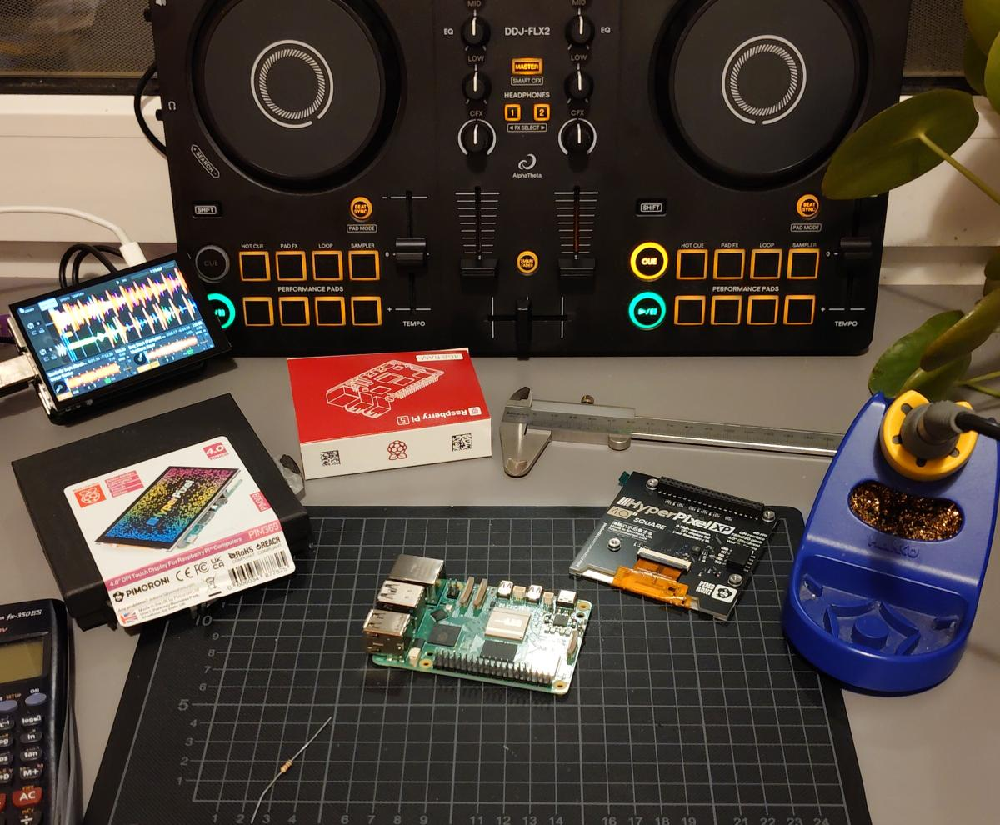

# Standalone Mixxx

This is a rough outline of the steps I followed to set up Mixxx on a Raspberry Pi as a standalone DJ deck using a MIDI controller like the DDJ-FLX4.



It’s mostly the result of trial and error rather than a clean, repeatable process—so think of it more as a reference than a proper step-by-step guide. If you’re looking for something more plug-and-play, it’s worth checking out prebuilt images instead.

## My Tested Setup

- Raspberry Pi 5 with 4 GB RAM
- Pimoroni HyperPixel 4.0 touch display
- Pioneer DJ DDJ-FLX4 and DDJ-FLX2 controller
- Raspberry Pi OS Desktop based on Debian 13 Trixie
- Mixxx installed from Raspberry Pi OS packages or built from source

Other combinations should work in theory, but your mileage may vary.

## Hardware

Hardware necessary for this project:

- [Raspberry Pi 5 with 4 GB RAM](https://www.raspberrypi.com/products/raspberry-pi-5/?variant=raspberry-pi-5-4gb), but 2 GB should be sufficient, especially if you do not intend to build Mixxx from source (not tested).
- [Raspberry Pi USB-C power supply](https://www.raspberrypi.com/products/27w-power-supply/), rated for at least 5.0A output current, depending on your MIDI controller needs too.
- [microSD card](https://www.sandisk.com/en-gb/products/memory-cards/microsd-cards/sandisk-extreme-pro-uhs-i-microsd?sku=SDSQXCG-032G-GN6MA) at least 16 GB or more, especially if you wish to record your mixes or build from source. Choose high-quality storage with good read/write speeds for faster boot time.
- Touch display like [Pimoroni HyperPixel 4.0](https://shop.pimoroni.com/products/hyperpixel-4?variant=12569485443155). With resolution 800x480 or higher.
- [DJ controller](https://www.pioneerdj.com/en/product/dj-controllers/ddj-flx4/) with built-in audio interface, like Pioneer DJ DDJ-FLX4 or DDJ-FLX2.
- Mouse and keyboard are helpful for the initial configuration.

## Operating System

Install the operating system using [pi-imager](https://www.raspberrypi.com/documentation/computers/getting-started.html#raspberry-pi-imager) onto the microSD card.

I chose to go with the standard Raspberry Pi OS Desktop based on Debian Trixie, and then remove the unnecessary desktop components.

You may choose to go with Raspberry Pi OS Lite and then install only the necessary components. This should produce a leaner system.

In the future I might look into providing ready-built and configured images.

### Provision Raspberry Pi OS

After the fresh installation, run the provisioning script to update Raspberry Pi OS, remove unnecessary desktop packages, disable slow or unused services, clean apt state, and print tuning diagnostics.

Preview the changes first:

```sh
chmod +x provision.sh
./provision.sh --dry-run
```

Then apply them:

```sh
./provision.sh
```

The default provisioning run is intentionally aggressive for a dedicated Mixxx appliance. It does not edit display overlays, boot cmdline, USB tuning, or real-time audio limits. Those areas are reported for review only.
Real runs are guarded to Raspberry Pi OS; set `PROVISION_ALLOW_UNSUPPORTED_OS=1` only if you intentionally use another Debian-based Pi image.

To run only part of the provisioning flow:

```sh
./provision.sh --updates
./provision.sh --packages
./provision.sh --services
./provision.sh --report
```

Reboot after package and service cleanup:

```sh
sudo reboot
```

Run `sudo raspi-config` for your own device-specific preferences.

### Desktop configuration

You can further customize the system to your liking, such as disabling media pop-ups, disabling UI notifications, and hiding the mouse. Use File Manager preferences and Control Centre preferences.

### Services

The provisioning script disables and masks known optional services that slow down boot or are not needed for a dedicated Mixxx appliance.

For manual inspection:

```sh
# Analyze the source of slowdowns
systemd-analyze blame
systemd-analyze critical-chain
```

This step is probably not necessary if you start with a Lite OS.
Be careful with additional service changes, as you may break networking, display login, or controller discovery by disabling the wrong unit.

## Display

Follow the installation and configuration guide of your display.

For the Pimoroni HyperPixel, add this line to `/boot/firmware/config.txt` unless your display vendor documents a different overlay:

```ini
dtoverlay=vc4-kms-dpi-hyperpixel4
```

Then disable I2C and GPIO if required by your display:

```sh
sudo vim /boot/firmware/config.txt
sudo raspi-config nonint do_i2c 1

# or using
sudo raspi-config
```

If you need to rotate the display, use the graphical Screen Configuration utility under `Preferences -> Control Centre -> Screens` in Raspberry Pi OS.

If boot is getting stuck waiting for `renderD128`, inspect the LightDM unit and create an override:

```sh
systemctl cat lightdm
sudo systemctl edit lightdm
```

In the editor, reset the `After` and `Wants` lists and re-add the same entries without `dev-dri-renderD128.device`:

```ini
[Unit]
After=
After=systemd-user-sessions.service dev-dri-card0.device
Wants=
Wants=dev-dri-card0.device
```

Compare against `systemctl cat lightdm` on your system and keep any other entries your installed unit needs. Then reload systemd:

```sh
sudo systemctl daemon-reload
systemctl cat lightdm
```

## Install Mixxx

The installer can install Mixxx, real-time audio permissions, controller mappings, and the LateNightMini skin in one run.
By default, it installs vanilla Mixxx from the Raspberry Pi OS package repository.

```sh
sh -c "$(curl -fsSL https://raw.githubusercontent.com/ghztomash/StandaloneMixxx/main/install.sh)" -- --bootstrap
```

The bootstrap command clones or updates this repository under `~/.local/share/standalone-mixxx/StandaloneMixxx`, then runs `install.sh` from that checkout.
It does not run the provisioning script. The default install does configure autostart from the managed checkout.
You can override the bootstrap checkout with `STANDALONE_MIXXX_REPO_URL`, `STANDALONE_MIXXX_REPO_BRANCH`, or `STANDALONE_MIXXX_REPO_DIR`.

If you already cloned this repository locally, you can run the installer directly:

```sh
./install.sh
```

To install only Mixxx:

```sh
./install.sh --mixxx
```

To configure only the real-time audio permissions:

```sh
./install.sh --realtime
```

To install the custom Mixxx build with additional Rekordbox-oriented features instead:

```sh
./install.sh --mixxx --custom
```

The custom Mixxx installer downloads the latest full GitHub release `.deb` from my fork and installs it with apt. It selects an `aarch64` or `x86_64` asset for the current system. If you want to pin a specific build, set `MIXXX_CUSTOM_RELEASE_API_URL`, set `MIXXX_CUSTOM_ASSET_GLOB`, or install the `.deb` manually.
The installer also installs whichever Qt SVG runtime package names are available on the local apt repository, such as `qt6-svg-plugins` or `libqt6svg6` plus `libqt6svgwidgets6`.

```sh
MIXXX_CUSTOM_RELEASE_API_URL=https://api.github.com/repos/ghztomash/mixxx/releases/latest ./install.sh --mixxx --custom
```

### Real-Time threads

Mixxx expects real-time audio threads to reduce latency. The installer configures these settings automatically during a full install, or when run with `./install.sh --realtime`.

If you need to configure them manually:

```sh
sudo usermod -aG audio "$USER"
sudo vim /etc/security/limits.d/95-audio.conf
```

And add to `95-audio.conf`

```sh
@audio - rtprio 95
@audio - memlock unlimited
@audio - nice -19
```

Check the changes after logging out and back in, or after rebooting. A shell that was already open before the change may still show the old values.

```sh
sudo reboot

groups

ulimit -r
ulimit -l
```

### Building Mixxx from source

If you would like to have additional features like:

- Rekordbox library waveform overviews
- Rekordbox library cover art
- Highlight loaded tracks
- Mark played tracks
- Fixed jog wheel response

You will need to build Mixxx from [source with my fixes](https://github.com/ghztomash/mixxx/tree/rekordbox-fixes-integration) applied.

You can either cherry pick my commits on top of `main` branch, or build my fork directly.

```sh
git clone https://github.com/ghztomash/mixxx.git
cd mixxx

git checkout rekordbox-fixes-integration
# or
git checkout rekordbox-rpi

# install development tools
./tools/debian_buildenv.sh setup

# build
mkdir build && cd build
cmake ..
cmake --build . --parallel $(nproc)
```

There should now be a `mixxx` executable in the `build` directory that you can run.

Building directly on the Raspberry Pi might take a couple of hours, so you might want to look into cross-compiling.

Follow the official Mixxx [developer documentation](https://github.com/mixxxdj/mixxx/blob/main/CONTRIBUTING.md) for more information.

### Skins

Install a skin that is optimized for small touch screens.


Like my [LateNightMini](https://github.com/ghztomash/LateNightMini) or the [Pioneered](https://github.com/timewasternl/Pioneered).

```sh
chmod +x install.sh
./install.sh --skin
```

The installer keeps a managed checkout in `~/.local/share/standalone-mixxx/LateNightMini`, updates it on rerun, and symlinks it into `~/.mixxx/skins/LateNightMini`.

To uninstall the managed skin symlink later:

```sh
./install.sh --remove --skin
```

Then open Mixxx and select LateNightMini in Preferences > Interface.

### Controller scripts

Mixxx already supports [many controllers](https://manual.mixxx.org/2.5/en/hardware/manuals) out of the box.

But if you want the user experience that follows more closely the Rekordbox workflow, install [my FLX controller scripts](https://github.com/ghztomash/FLX-Mixxx).

```sh
./install.sh --controllers
```

The installer keeps a managed checkout in `~/.local/share/standalone-mixxx/FLX-Mixxx`, updates it on rerun, and symlinks the top-level controller `.js` and `.xml` files into `~/.mixxx/controllers`.

Run `./install.sh` with no target flag to install or update Mixxx, the skin, controller scripts, and desktop autostart in one step.

To uninstall the managed symlinks later:

```sh
./install.sh --remove --controllers
```

Then open Mixxx and select the DDJ-FLX2 or DDJ-FLX4 device in Preferences -> Controllers. Load the matching mapping named Pioneer DDJ-FLX2-ghz or Pioneer DDJ-FLX4-ghz.

## Auto start

I made a launcher script that monitors connected audio devices and launches Mixxx once a controller is connected.

Enable desktop auto-login so the autostart entry can run after boot:

```sh
sudo raspi-config
```

Choose the boot option that starts the graphical desktop and logs in automatically.

If you did not run the full installer, install the autostart entry:

```sh
./install.sh --autostart
```

Connect and check your controller with `aplay -l`

The installer writes `~/.config/autostart/mixxx.desktop` with an absolute path to `mixxx-launcher.sh` in this checkout. The default `DEVICE_NAME="DDJFLX"` is intentionally a broad `grep` pattern so it can match related ALSA device names such as DDJFLX2 and DDJFLX4. If you use a different controller, edit `mixxx-launcher.sh` in this checkout and update `DEVICE_NAME` to a pattern shown by `aplay -l`.

The launcher log uses `$HOME/.mixxx/mixxx_launcher.log`.

Verify the launcher:

```sh
bash -n mixxx-launcher.sh
./mixxx-launcher.sh
tail -f ~/.mixxx/mixxx_launcher.log
```

## Troubleshooting

- Controller not detected: run `aplay -l` and adjust `DEVICE_NAME` in `mixxx-launcher.sh`.
- Mixxx does not start on login: check that `~/.config/autostart/mixxx.desktop` exists and points to this checkout's `mixxx-launcher.sh`.
- Audio latency is too high: confirm the user is in the `audio` group with `groups`, then check `ulimit -r` and `ulimit -l`.
- Missing Mixxx icons: install the Qt SVG runtime package for your OS, such as `qt6-svg-plugins` or `libqt6svg6` plus `libqt6svgwidgets6`.

## Acknowledgments

For more inspiration, check out the amazing work of:

- [Pioneered](https://github.com/timewasternl/Pioneered)
- [XDJ100SX](https://github.com/marcmonka/XDJ100SX)
- <https://github.com/EmperorJack/mixxx-pi-config>
- <https://github.com/fibonacid/foss-dj-player>
