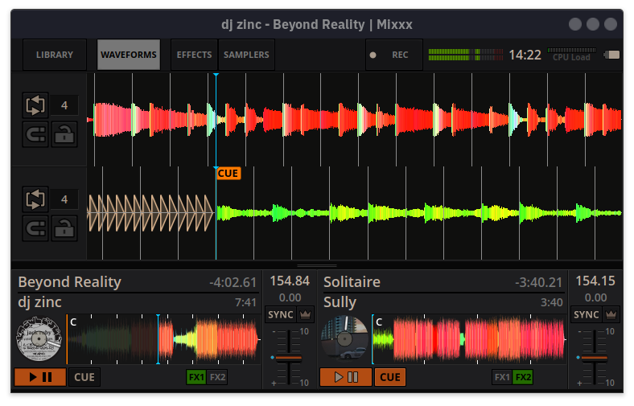

# Standalone Mixxx

This is a short guide for setting up Mixxx on a Raspberry Pi to act as a standalone DJ deck with a MIDI controller like DDJ-FLX4.

This guide is focused on a Raspberry Pi 5 4GB with a Pimoroni HyperPixel 4.0 touch display, DDJ-FLX4, and Raspberry Pi OS based on Debian 13 Trixie. Other combinations should work in theory, but your mileage may vary.

## Known Tested Setup

- Raspberry Pi 5 with 4 GB RAM
- Pimoroni HyperPixel 4.0 touch display
- Pioneer DJ DDJ-FLX4 controller
- Raspberry Pi OS Desktop based on Debian 13 Trixie
- Mixxx installed from Raspberry Pi OS packages or built from source

## Hardware

Hardware necessary for this project:

- [Raspberry Pi 5 with 4 GB RAM](https://www.raspberrypi.com/products/raspberry-pi-5/?variant=raspberry-pi-5-4gb), but 2 GB should be sufficient, especially if you do not intend to build Mixxx from source (not tested).
- [Raspberry Pi USB-C power supply](https://www.raspberrypi.com/products/27w-power-supply/), rated for at least 5.0A output current, depending on your MIDI controller needs too.
- [microSD card](https://www.sandisk.com/en-gb/products/memory-cards/microsd-cards/sandisk-extreme-pro-uhs-i-microsd?sku=SDSQXCG-032G-GN6MA) at least 16 GB or more, especially if you wish to record your mixes or build from source. Choose high-quality storage with good read/write speeds for faster boot time.
- Touch display like [Pimoroni HyperPixel 4.0](https://shop.pimoroni.com/products/hyperpixel-4?variant=12569485443155). With resolution 800x480 or higher.
- [DJ controller](https://www.pioneerdj.com/en/product/dj-controllers/ddj-flx4/) with built-in audio interface, like Pioneer DJ DDJ-FLX4 or DDJ-FLX2.
- Mouse and keyboard are helpful for the initial configuration.

## Operating System

Install the operating system using [pi-imager](https://www.raspberrypi.com/documentation/computers/getting-started.html#raspberry-pi-imager) onto the microSD card.

I chose to go with the standard Raspberry Pi OS Desktop based on Debian Trixie, and then remove the unnecessary desktop components.

You may choose to go with Raspberry Pi OS Lite and then install only the necessary components. This should produce a leaner system.

In the future I might look into providing ready-built and configured images.

### Configure the OS

After the fresh installation, update and configure your operating system:

```sh
sudo apt update

# Remove any unwanted software
sudo apt remove -y rpi-connect cloud-init chromium cups geany thonny agnostics rpi-imager piclone rp-bookshelf rp-prefapps rpi-userguide rpinters

# Update the remaining software
sudo apt full-upgrade -y

# Clean up
sudo apt autoremove -y
sudo apt autoclean -y

# Do your preference configuration
sudo raspi-config
sudo vim /boot/firmware/config.txt

# Kernel options
sudo vim /boot/firmware/cmdline.txt
```

### Desktop configuration

You can further customize the system to your liking, such as disabling media pop-ups, disabling UI notifications, and hiding the mouse. Use File Manager preferences and Control Centre preferences.

### Services

**Optional** - disable unwanted services that slow down boot:

```sh
# Analyze the source of slowdowns
systemd-analyze blame
systemd-analyze critical-chain

# Disable any unwanted services
sudo systemctl disable NetworkManager-wait-online.service
sudo systemctl mask NetworkManager-wait-online.service

sudo systemctl disable ModemManager
sudo systemctl mask ModemManager

sudo systemctl disable bluetooth
sudo systemctl mask bluetooth
```

This step is probably not necessary if you start with a Lite OS.
And is for more advanced users, as you may break your system by removing the wrong service.

## Display

Follow the installation and configuration guide of your display.

For the Pimoroni HyperPixel, add this line to `/boot/firmware/config.txt` unless your display vendor documents a different overlay:

```ini
dtoverlay=vc4-kms-dpi-hyperpixel4
```

Then disable I2C and GPIO if required by your display:

```sh
sudo vim /boot/firmware/config.txt
sudo raspi-config nonint do_i2c 1

# or using
sudo raspi-config
```

If you need to rotate the display, use the graphical Screen Configuration utility under `Preferences -> Control Centre -> Screens` in Raspberry Pi OS.

If boot is getting stuck waiting for `renderD128`, inspect the LightDM unit and create an override:

```sh
systemctl cat lightdm
sudo systemctl edit lightdm
```

In the editor, reset the `After` and `Wants` lists and re-add the same entries without `dev-dri-renderD128.device`:

```ini
[Unit]
After=
After=systemd-user-sessions.service dev-dri-card0.device
Wants=
Wants=dev-dri-card0.device
```

Compare against `systemctl cat lightdm` on your system and keep any other entries your installed unit needs. Then reload systemd:

```sh
sudo systemctl daemon-reload
systemctl cat lightdm
```

## Install Mixxx

The easiest path is to install vanilla Mixxx.

But if you want additional features that match the expected Rekordbox user experience, you might need to build Mixxx from scratch with my changes applied.

```sh
sudo apt install mixxx

# If some icons are missing from the Mixxx UI
sudo apt install qt6-svg-plugins
```

### Real-Time threads

Mixxx expects real-time audio threads to reduce latency.

```sh
sudo usermod -aG audio "$USER"
sudo vim /etc/security/limits.d/95-audio.conf
```

And add to `95-audio.conf`

```sh
@audio - rtprio 95
@audio - memlock unlimited
@audio - nice -19
```

Check the changes

```sh
sudo reboot

groups

ulimit -r
ulimit -l
```

### Building Mixxx from source

If you would like to have additional features like:
- Rekordbox library waveform overviews
- Rekordbox library cover art
- Highlight loaded tracks
- Mark played tracks
- Fixed jog wheel response

You will need to build Mixxx from [source with my fixes](https://github.com/ghztomash/mixxx/tree/rekordbox-fixes-integration) applied.

You can either cherry pick my commits on top of `main` branch, or build my fork directly.

```sh
git clone https://github.com/ghztomash/mixxx.git
cd mixxx

git checkout rekordbox-fixes-integration
# or
git checkout rekordbox-pi

# install development tools
./tools/debian_buildenv.sh setup

# build
mkdir build && cd build
cmake ..
cmake --build . --parallel $(nproc)
```

There should now be a `mixxx` executable in the `build` directory that you can run.

Building directly on the Raspberry Pi might take a couple of hours, so you might want to look into cross-compiling.

Follow the official Mixxx [developer documentation](https://github.com/mixxxdj/mixxx/blob/main/CONTRIBUTING.md) for more information.

### Skins

Install a skin that is optimized for small touch screens.



Like my [LateNightMini](https://github.com/ghztomash/LateNightMini) or the [Pioneered](https://github.com/timewasternl/Pioneered).

```sh
git clone https://github.com/ghztomash/LateNightMini.git ~/.mixxx/skins/LateNightMini
```

Then open Mixxx and select LateNightMini in Preferences > Interface.

### Controller scripts

Mixxx already supports [many controllers](https://manual.mixxx.org/2.5/en/hardware/manuals) out of the box.

But if you want the user experience that follows more closely the Rekordbox workflow, install my FLX controller scripts.

```sh
git clone https://github.com/ghztomash/FLX-Mixxx.git ~/.mixxx/controllers
```

Then open Mixxx and select the DDJ-FLX2 or DDJ-FLX4 device in Preferences -> Controllers. Load the matching mapping named Pioneer DDJ-FLX2-ghz or Pioneer DDJ-FLX4-ghz.

## Auto start

I made a launcher script that monitors connected audio devices and launches Mixxx once a controller is connected.

Enable desktop auto-login so the autostart entry can run after boot:

```sh
sudo raspi-config
```

Choose the boot option that starts the graphical desktop and logs in automatically.

Copy the launcher and desktop file:

```sh
cp mixxx-launcher.sh ~/mixxx-launcher.sh
chmod +x ~/mixxx-launcher.sh

mkdir -p ~/.config/autostart
cp autostart/mixxx.desktop ~/.config/autostart/mixxx.desktop
```

Connect and check your controller with `aplay -l`

Edit `~/mixxx-launcher.sh` and update `DEVICE_NAME="DDJFLX4"` to match your controller. If your Raspberry Pi username is not `pi`, also update the `/home/pi/...` paths in `~/mixxx-launcher.sh` and `~/.config/autostart/mixxx.desktop`.

Verify the launcher:

```sh
bash -n ~/mixxx-launcher.sh
~/mixxx-launcher.sh
tail -f ~/.mixxx/mixxx_launcher.log
```

## Troubleshooting

- Controller not detected: run `aplay -l` and adjust `DEVICE_NAME` in `~/mixxx-launcher.sh`.
- Mixxx does not start on login: check that `~/.config/autostart/mixxx.desktop` exists and `~/mixxx-launcher.sh` is executable.
- Audio latency is too high: confirm the user is in the `audio` group with `groups`, then check `ulimit -r` and `ulimit -l`.
- Missing Mixxx icons: install `qt6-svg-plugins`.

## Contributors

- [Tomash GHz](https://github.com/ghztomash)

## References

For more inspiration, check out the amazing work of:

- [Pioneered](https://github.com/timewasternl/Pioneered)
- [XDJ100SZ](https://github.com/marcmonka/XDJ100SX)
- https://github.com/fibonacid/foss-dj-player
